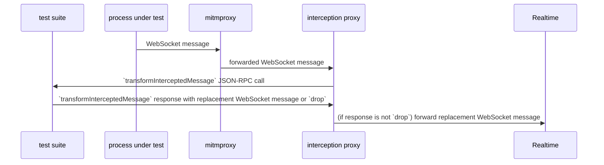

# RFC: Use an intercepting proxy to observe and manipulate realtime protocol communications in unified test suite

## Background

Given that Evgenii is in the process of writing adapters that make our various client SDKs look like ably-js, our plan is to try and reuse the ably-js test suite as our unified test suite, so that we don’t have to write a whole new test suite from scratch.

A large blocker in doing this is the fact that the ably-js test suite (no differently to our other SDKs’ test suites) makes non-trivial use of the SDK’s private API. To be able to reuse the ably-js test suite as the UTS, we’ll probably need a two-step approach:

1. Reduce the test suite’s usage of private API as much as is practically possible;
2. For the remaining necessary usage of private API in the test suite, define a common testing private API to be implemented across all of our SDKs, which can then be exposed by our adapters and hence used by the test suite.

In [ECO-4786](https://ably.atlassian.net/browse/ECO-4786), I went through the ably-js test suite and catalogued its usage of private API.

## Scope of this RFC

In this RFC, I’ll explore how we might remove one of the usages of private API which is quite common in the ably-js test suite; namely, to observe and manipulate protocol messages exchanged between a client and Realtime.

By “observe and manipulate”, I mean usage of private APIs that allows the test suite to be informed when a protocol message is sent, and which gives it the ability to do the following:

- continue execution of the test
- make an assertion about the contents of the protocol message
- update some test-local state, possibly based on the contents of the protocol message
- modify the contents of the protocol message before it’s sent to the other endpoint
- drop the protocol message so that it isn’t sent to the other endpoint 

The tests also use private API for achieving something related to the above; namely, to inject _additional_ protocol messages from the server to the client. I will not explore that use case in this RFC, but I believe that it should be easy to add such functionality to the prototype solution that I describe here.

## Current usage of private APIs for observation and manipulation of protocol messages

To observe and maniplate client-to-server protocol messages, our tests replace the following:

- `channel.sendPresence`
- `transport.send`
- `channels.sendMessage`
- `connectionManager.send`

To observe and manipulate server-to-client protocol messages, our tests replace the following:

- `channel.processMessage`
- `transport.onProtocolMessage`
- `connectionManager.onChannelMessage`

## Desirable characteristics of solution

A few things that I’d like:

- Minimally invasive to the way the tests are written: I would like to be able to remove the above usage of private API in a way that doesn’t require me to completely change the logic of the existing tests. Ideally, I’d like for the test suite to be able to replace this private API usage with some new test suite API that looks very similar.
- Noninvasive to the tests’ usage of the SDK: meaning that we don’t have to disable TLS, or configure a specific `realtimeHost`. This will allow us to continue to test the SDK’s default behaviours as we do now.
- Noninvasive to development environment: meaning that its effects are tightly scoped to the test suite; that is, you don’t have to give root access to some piece of test tooling, or install trust anchors that could weaken the security of your development machine if you aren’t careful about managing their private keys, or allow all of your development machine’s web traffic to be man-in-the-middled by some piece of test tooling, or modify your `etc/hosts`.
- Cross-platform: The universal test suite is going to be used on diverse OSs (macOS, Linux, Windows) for SDKs running in diverse environments (browser, Node, an iOS simulator, an Android emulator, etc). In order to be useful, our solution needs to support them all.

## Prior art at Ably

When developing (and subsequently debugging) the short-lived Asset Tracking SDK, we wanted to write some automated tests that helped us to understand how the SDK behaved under certain network conditions, such as:

- TCP connection to Realtime refused
- packet loss
- loss of Realtime protocol messages of a particular type

To achieve this, we created the [SDK Test Proxy](https://github.com/ably/sdk-test-proxy/tree/main). The process of interacting with it is roughly the following:

1. Run the proxy server
2. Make a REST API call to the proxy server, requesting that it create a proxy that exhibits one of several canned “faults” (for example, a fault might be to simulate one of the above network conditions for a certain amount of time)
3. The REST call returns you a TCP port number
4. In the tests, you configure your Realtime client to:
   - use a `realtimeHost` of `localhost`
   - use the `port` provided to you by the above REST call
   - not use TLS
5. And then, optionally, at some point during the execution fo the tests, you issue a REST API call to the proxy server to tell it to disable the fault (i.e. restore normal network conditions).

My not-necessarily-compelling reason for not wanting to proceed with further development on this tool is that it’s written in Kotlin, which is a language that I’m pretty unfamiliar with and don’t particularly want to have to get better at right now. But, let’s also see how, as currently written, it measures up against a couple of the desiderata above:

- Minimally invasive to the way the tests are written: No — the above "configure a rule and then leave it running" logic is quite different to the tests’ current "full awareness of each protocol message as it occurs" approach.
- Noninvasive to the tests’ usage of the SDK: No — you have to override a bunch of the SDK’s defaults, and you can’t use TLS.

The SDK Test Proxy was developed in a fairly short space of time, and I don’t think that we put enough development effort into it for us to now feel compelled to try and reuse what’s already there.

## A sketch of a solution

I think that roughly, we’d like the following: 

- A service (let’s call it the “interception service” for now) that receives all WebSocket connections initiated by the SDK and forwards them to the server.
- 2-way communication between the test suite and the interception service, enabling the interception service to inform the test suite each time it intercepts a message, and to ask the test suite what to do with the message.

## Implementation options

The first thing that springs to mind when thinking about adding an intermediary in the establishment of a WebSocket connection is to use something like an HTTP proxy or a SOCKS proxy. Unfortunately, this is something that needs to be supported by the WebSocket library used by the Ably client SDK, and we don’t currently offer support for proxies for WebSocket connections across all of our SDKs; for example, see [ably-java#120](https://github.com/ably/ably-java/issues/120) or [ably-dotnet#159](https://github.com/ably/ably-dotnet/issues/159).

So, we can see that the range of interception mechanisms available to us varies depending on the platform. Upon realising this, I thought that at least some of this must be a solved problem, and decided to look into a piece of software that I’d heard of before but never used, called [mitmproxy](https://mitmproxy.org).

## What’s mitmproxy?

It describes itself as “a free and open source interactive HTTPS proxy”. 

- The “interactive” part means that it allows you, the user of mitmproxy, to observe and manipulate HTTP and WebSocket traffic as it passes through the proxy. You can do this either through a UI, or programmatically by writing an addon.
- The “HTTPS” part means that it can perform TLS man-in-the-middling for you.
- The “proxy” part means many things. What it really means is that it acts as an intermediary in HTTP and WebSocket exchanges. It also means, importantly for us, that it provides you with a diverse range of manners in which it can be inserted as an intermediary in these exchanges. It calls these its [modes of operation](https://docs.mitmproxy.org/stable/concepts-modes/). These modes of operation each require different levels of cooperation from the process whose traffic you wish to intercept. One of them is that it can run as an HTTP or SOCKS proxy. But, as mentioned above, this isn’t enough for us. This is when its other modes of operation come in useful; they allow it to perform its interception in a way that requires less cooperation.

mitmproxy provides instructions for usage on macOS, Windows, and Linux (however, the available modes of operation vary by OS). It appears to be a mature and maintained piece of software (I raised a couple of questions whilst working on this RFC and the maintainer was very quick to respond).

## Attempt at a solution

Now I’ll describe my attempt at implementing the [aforementioned sketch of a solution](#a-sketch-of-a-solution). It’s very much a prototype and cuts plenty of corners (see the TODOs in the code). You can find the current implementation in [this ably-js PR](https://github.com/ably/ably-js/pull/1737).

**Note:** In my original approach, I tried implementing everything inside a mitmproxy addon. This didn’t work because mitmproxy did not provide me with sufficient control over WebSocket connection lifetimes; see [my question on mitmproxy discussions](https://github.com/mitmproxy/mitmproxy/discussions/6784). Hence the current approach, where mitmproxy is used only for handling traffic interception and TLS MITM-ing.

Here’s a sequence diagram showing what happens in the interception of a single WebSocket message from the client to Realtime:

The participants are the following:

- _test suite_: The process which is executing the tests.
- _process under test_: The process which is running the Ably client library. (In the current situation, when running the ably-js test suite, this is the same as the test suite, but in the unified test suite they will be separate entities.)
- _mitmproxy_: A mitmproxy instance which, through some configuration, is intercepting all of the WebSocket connections initiated by the process under test, and which is running an addon that causes it to forward these connections to the interception proxy.
- _interception proxy_: A server (written by us) which has two responsibilities:
  - communication with the test suite
  - receiving WebSocket connections from the interception proxy and forwarding them to Realtime

As the diagram suggests, communication between the test suite and interception proxy happens through a JSON-RPC API. I’ll now document this API.

### JSON-RPC methods implemented in interception proxy

Implemented via text WebSocket messages exchanged between proxy and test suite. The WebSocket server is run by the proxy at `http://localhost:8001`.

#### `startInterception`

The test suite calls this method on the proxy at the start of the test suite. It:

- results in an error if there is already an active test suite
- marks the WebSocket connection as belonging the active test suite (there is currently no way to undo this; to set a new active test suite you must restart the proxy)
- sets up a proxy for intercepting traffic (this may require cooperation from the tests; see `mode` below)

Request params is one of the following objects:

- `{ 'mode': 'local', 'pid': number }`: transparently intercept traffic from the process with the given PID (note that this is currently only used on macOS; in Linux we do interception by UID with the help of a bunch of `iptables` configuration, see `test-node.yml` workflow for now)
- `{ 'mode': 'proxy' }`: run an HTTP proxy which listens on port 8080

Response result is an empty object.

#### `transformInterceptedMessage`

The proxy calls this method on the active test suite each time a WebSocket message is intercepted. The test suite must return a result telling the proxy what to do with the message. Subsequent messages intercepted on that WebSocket connection, in the direction described by `fromClient`, will be queued pending the test suite’s reply.

Request params is an object with the following properties:

- `id`: a unique identifier for this message
- `connectionID`: a unique identifer for the intercepted WebSocket connection that this message belongs to
- `type`:
  - `binary` if the intercepted message is of Binary type
  - `text` if it is of Text type
- `data`: the data of the intercepted WebSocket message
  - if `type` is `binary`, then this value is Base64-encoded
- `fromClient`: boolean describing the direction in which the intercepted message was sent

Response result is one of the following objects:

- `{ "action": "drop" }`: this will cause the proxy to drop the intercepted message
- `{ "action": "replace", "type": "binary", "data": "(…)" }`: this will cause the proxy to replace the intercepted message with a message of Binary type whose data is the result of Base64-decoding the `data` property
- `{ "action": "replace", "type": "text", "data": "(…)" }`: this will cause the proxy to replace the intercepted message with a message of Text type whose data is the value of the `data` property

### Test suite API

So, the test suite starts up, tells the interception proxy to start intercepting, and then what? How do the tests tell the proxy what to do with the intercepted WebSocket messages?

For this, the test suite offers a class called `InterceptionProxyClient`, an instance of which is available to the test cases. By default, this client responds to all `transformInterceptedMessage` calls with a replacement identical to the original message; that is, it lets all messages pass through unaltered.

The client offers an API for test cases to change this behaviour. I won’t go into much detail on the API because I haven’t put much thought into it yet, but basically it gives a test case the ability to set `transformClientMessage` and `transformServerMessage` callbacks which are called each time a message is intercepted, and which either return a replacement message, or `null` to drop the message. For an example of how it might look to use this API, look at `test/realtime/connection.test.js` in the aforementioned PR, which replaces one test case’s usage of the private `transport.send` API with this interception API. You’ll see that the code doesn’t change very much.

## Does it work?

In the aforementioned PR, I’ve got this running in CI for Node and browsers. With the exception of one test case which I converted as a demonstration, the rest of the tests are untouched; that is, traffic passes through the interception mechanism but comes out unaltered.

The Node and Firefox tests are passing. The WebKit and Chromium tests have a couple of failures, which I have not yet investigated. Hopefully they’re minor things that do not invalidate the approach, but I can’t say for sure.

## How the prototype scores against desirable characteristics

Now we return to our above [desirable characteristics](#desirable-characteristics-of-solution).

- Minimally invasive to the way the tests are written: Hard to say for sure without actually converting more tests to use it, and there’s still an outstanding question about scoping interception to particular objects (see later), but I _think_ that using this mechanism will not require large changes to the existing tests; it looks like we’ll be able to use it as a drop-in replacement for the aforementioned private API usage in many cases.
- Noninvasive to the tests’ usage of the SDK: Yes, I didn’t have to change anything about how the tests configure the SDK.
- Noninvasive to development environment: Fairly. Depends a lot on the OS and the platform. For example, in what I’ve tried out so far:
  - Browsers:
    - Interception: We run mitmproxy as an HTTP proxy and are able to configure Playwright to use this proxy without having to change any global proxy settings.
    - TLS MITM: To install mitmproxy’s root CA cert as a trust anchor for the browser under test may require some global configuration. Firefox doesn’t (you can install the cert into a Firefox profile created just for that test run), but Chromium and WebKit appear to require that the certificate be installed in the system trust store.
  - Node:
    - Interception: in macOS we use mitmproxy’s local redirect mode, which allows us to target a specific PID, so that’s nice. In Linux (currently only tested in CI) we instead target all traffic coming from processes with a specific owner (that is, we create a user who runs the tests). We do this via iptables rules, which can only be configured by root. Currently you have to create this user and set up these rules yourself; if we wanted this to be done by the interception proxy instead then you’d probably need to configure some tight sudoers rules to control what it’s allowed to do.
    - TLS MITM: No problem; you can set the `NODE_EXTRA_CA_CERTS` environment variable.
- Cross-platform: I’ve shown that you can get things working (more or less) on browsers and Node on macOS and Linux. Windows, I don’t know (but mitmproxy at least advertises Windows support, but I haven’t looked into what that means). Other _platforms_ (e.g. Android emulator, iOS simulator), won’t know until we try. If it turns out that mitmproxy limits us in certain cases, I guess that in those cases we could try finding some other tool to perform what mitmproxy is currently doing (interceptions and TLS MITMing), and put that in front of the interception proxy instead 🤷

## Limitations of prototype

- With the existing private API usage, protocol message observation and manipulation is scoped to a specific object; that is, we can choose to intercept the messages going to or from a specific channel object or transport object etc. When using the interception proxy, we can’t perform this kind of targeting since we have no way of identifying which SDK object a protocol message came from; the most granular information we have is which WebSocket connection a message came from. I don’t yet know whether this is a big limitation or not, because I don’t know how much the tests rely on the scoped nature of these interceptions.
- The prototype only offers a mechanism for intercepting WebSocket messages. It does not allow you to intercept protocol messages exchanged over a Comet transport. I think we could build this support later if we wanted, but maybe it’s lower priority since only ably-js uses Comet transports; I think we could disable Comet in the unified test suite for now.
- Other than protocol messages, a WebSocket connection carries other data that’s meaningful in the context of a realtime client; namely, some data in the WebSocket client handshake, and WebSocket `PING` and `PONG` frames. The test suite currently observes and manipulates this data using private APIs other than those I was focussing on in this RFC, but if we do proceed with this approach then we’ll at some point need to update the interception proxy to allow observation and/or manipulation of this data.

## Test execution time

I don’t have any numbers to offer on test execution time, but my anecdotal observations are that it’s increased but not by an amount that we need to worry about right now.

## Conclusion

I think that the approach outlined above and prototyped is a promising one, and I suggest that we go with it. I think we won’t fully understand its limitations until we try using it to actually replace the private API usage that it aims to, and until we do it on more platforms.

Next steps / questions:

- Investigate the aforementioned browser test failures, just to be sure they’re nothing alarming
- Decide whether to turn the prototype into a proper piece of software (tests etc) or do that later once we have a better idea of its fitness for purpose and how much we’re likely to need to modify it
- Are we going to merge this into ably-js as well, or is it just for the unified test suite? If for ably-js, then we need to think about how all of this newly-required infrastructure will affect the development experience of ably-js, as well as the life of people who run its tests for other reasons (I think the Realtime team do). It might be disruptive.
- Plan and execute the test changes that this RFC implies
