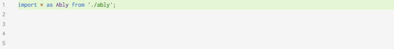

# [Ably](https://www.ably.com)

[](https://github.com/ably/ably-js/actions/workflows/features.yml)

_[Ably](https://ably.com) is the platform that powers synchronized digital experiences in realtime. Whether attending an event in a virtual venue, receiving realtime financial information, or monitoring live car performance data – consumers simply expect realtime digital experiences as standard. Ably provides a suite of APIs to build, extend, and deliver powerful digital experiences in realtime for more than 250 million devices across 80 countries each month. Organizations like Bloomberg, HubSpot, Verizon, and Hopin depend on Ably’s platform to offload the growing complexity of business-critical realtime data synchronization at global scale. For more information, see the [Ably documentation](https://ably.com/docs)._

[](https://img.shields.io/npm/v/ably.svg?style=flat)

This is a JavaScript client library for Ably Realtime.

This library currently targets the [Ably client library features spec](https://www.ably.com/docs/client-lib-development-guide/features/) Version 1.2. You can jump to the '[Known Limitations](#known-limitations)' section to see the features this client library does not yet support or [view our client library SDKs feature support matrix](https://www.ably.com/download/sdk-feature-support-matrix) to see the list of all the available features.

## Supported platforms

This SDK supports the following platforms:

**Browsers:** All major desktop and mobile browsers, including (but not limited to) Chrome, Firefox, IE (only version 9 or newer), Safari on iOS and macOS, Opera, and Android browsers.

**Webpack:** see [using Webpack in browsers](#using-webpack), or [our guide for serverside Webpack](#serverside-usage-with-webpack)

**Node.js:** version 8.17 or newer. (1.1.x versions work on Node.js 4.5 or newer). We do not currently provide an ESM bundle, please [contact us](https://www.ably.com/contact) if you would would like to use ably-js in a NodeJS ESM project.

**React (release candidate)** We offer a set of React Hooks which make it seamless to use ably-js in your React application. See the [React Hooks documentation](./docs/react.md) for more details.

**React Native:** We aim to support all platforms supported by React Native. If you find any issues please raise an issue or [contact us](https://www.ably.com/contact).

**NativeScript:** see [ably-js-nativescript](https://github.com/ably/ably-js-nativescript)

**TypeScript:** see [below](#typescript)

**WebWorkers**: We build a separate bundle which supports running in a [Web Worker](https://developer.mozilla.org/en-US/docs/Web/API/Web_Workers_API) context. You can import it like this:

```js
import Ably from 'ably/build/ably-webworker.min';
```

We regression-test the library against a selection of those (which will change over time, but usually consists of the versions that are supported upstream, plus old versions of IE).

However, we aim to be compatible with a much wider set of platforms and browsers than we can possibly test on. That means we'll happily support (and investigate reported problems with) any reasonably-widely-used browser. So if you find any compatibility issues, please do [raise an issue](https://github.com/ably/ably-js/issues) in this repository or [contact Ably customer support](https://support.ably.com) for advice.

Ably-js has fallback mechanisms in order to be able to support older browsers; specifically it supports comet-based connections for browsers that do not support websockets, and this includes JSONP for browsers that do not support cross-origin XHR. Each of these fallback transport mechanisms is supported and tested on all the browsers we test against, even when those browsers do not themselves require those fallbacks. These mean that the library should be compatible with nearly any browser on most platforms.
Known browser incompatibilities will be documented as an issue in this repository using the ["compatibility" label](https://github.com/ably/ably-js/issues?q=is%3Aissue+is%3Aopen+label%3A%22compatibility%22).

For complete API documentation, see the [Ably documentation](https://www.ably.com/docs).

## Installation

### Node.js

    npm install ably --save

and require as:

```javascript
var Ably = require('ably');
```

For the version of the library where async methods return promises, use `var Ably = require('ably/promises');` instead. For the explicitly-callback-based variant use `require('ably/callbacks')`– see [Async API style](#async-api-style).

For usage, jump to [Using the Realtime API](#using-the-realtime-api) or [Using the REST API](#using-the-rest-api).

#### Serverside usage with webpack

If you are using a version older than 1.2.5 you will need to add 'ably' to `externals` in your webpack config to exclude it from webpack processing, and require and use it in as a external module using require('ably') as above.

### For browsers

Include the Ably library in your HTML:

```html
<script src="https://cdn.ably.com/lib/ably.min-1.js"></script>
```

The Ably client library follows [Semantic Versioning](http://semver.org/). To lock into a major or minor version of the client library, you can specify a specific version number such as https://cdn.ably.com/lib/ably.min-1.js for all v1._ versions, or https://cdn.ably.com/lib/ably.min-1.0.js for all v1.0._ versions, or you can lock into a single release with https://cdn.ably.com/lib/ably.min-1.0.9.js. Note you can load the non-minified version by omitting `min-` from the URL such as https://cdn.ably.com/lib/ably-1.0.js. See https://github.com/ably/ably-js/tags for a list of tagged releases.

For usage, jump to [Using the Realtime API](#using-the-realtime-api) or [Using the REST API](#using-the-rest-api).

#### Using WebPack

(This applies to using webpack to compile for a browser; for Node.js, see [Serverside usage with webpack](#serverside-usage-with-webpack))

WebPack will search your `node_modules` folder by default, so if you include `ably` in your `package.json` file, when running Webpack the following will allow you to `require('ably')` (or if using typescript or ES6 modules, `import * as Ably from 'ably';`). If your webpack target is set to 'browser', this will automatically use the browser commonjs distribution.

If that doesn't work for some reason (e.g. you are using a custom webpack target), you can reference the `ably-commonjs.js` static file directly: `require('ably/build/ably-commonjs.js');` (or `import * as Ably from 'ably/build/ably-commonjs.js'` for typescript / ES6 modules).

### TypeScript

The TypeScript typings are included in the package and so all you have to do is:

```typescript
import * as Ably from 'ably';

let options: Ably.Types.ClientOptions = { key: 'foo' };
let client = new Ably.Realtime(options); /* inferred type Ably.Realtime */
let channel = client.channels.get('feed'); /* inferred type Ably.Types.RealtimeChannel */
```

For the version of the library where async methods return promises, use `import * as Ably from 'ably/promises';` instead. For the explicitly-callback-based variant use `import * as Ably from 'ably/callbacks'` – see [Async API style](#async-api-style).

Intellisense in IDEs with TypeScript support is supported:



If you need to explicitly import the type definitions, see [ably.d.ts](./ably.d.ts) (or `promises.d.ts` if you're requiring the library as `ably/promises`).

## Async API style

This library exposes two API variants. Firstly, the original (and presently the default) callback-based API, which follows the usual Node.js error-first callback style. Second, a promises-based API. With the promises variant, you can still pass a callback to methods and the callback will work as expected, but if you do not pass a callback, the method will return a promise. The API in use can be selected explicitly by requiring that specific variant when requiring/importing the library (or in the case of the browser version, when instantiating it). The usage instructions below make reference to both variants.

For this library version, and for all future 1.x versions, the callback-based API will be the default. This means that the promises-based variant will need to be explicitly selected, to avoid breaking backwards compatibility. A move to the promises-based variant as the default is likely at the next major release (i.e. 2.x onwards).

For usage, jump to [Using the async API style](#using-the-async-api-style).

## NativeScript

See the [ably-js-nativescript repo](https://github.com/ably/ably-js-nativescript) for NativeScript usage details.

## Using the Realtime API

This readme gives some basic examples; for our full API documentation, please go to https://www.ably.com/docs .

### Introduction

All examples assume a client has been created as follows:

```ts
// basic auth with an API key
var client = new Ably.Realtime(key: string);

// using a Client Options object, see https://www.ably.com/docs/rest/usage#client-options
// which must contain at least one auth option, i.e. at least
// one of: key, token, tokenDetails, authUrl, or authCallback
var client = new Ably.Realtime(options: ClientOptions);

// For a version of the library where async methods return promises if
// you don't pass a callback:
var client = new Ably.Realtime.Promise(options: string | ClientOptions);

// For the explicitly-callback-based variant (see 'Async API style' below):
var client = new Ably.Rest.Callbacks(options: string | ClientOptions);
```

### Connection

Successful connection:

```javascript
client.connection.on('connected', function() {
  # successful connection
});
```

Failed connection:

```javascript
client.connection.on('failed', function() {
  # failed connection
});
```

### Subscribing to a channel

Given:

```javascript
var channel = client.channels.get('test');
```

Subscribe to all events:

```javascript
channel.subscribe(function (message) {
  message.name; // 'greeting'
  message.data; // 'Hello World!'
});
```

Only certain events:

```javascript
channel.subscribe('myEvent', function (message) {
  message.name; // 'myEvent'
  message.data; // 'myData'
});
```

### Subscribing to a channel with deltas

Subscribing to a channel in delta mode enables [delta compression](https://www.ably.com/docs/realtime/channels/channel-parameters/deltas). This is a way for a client to subscribe to a channel so that message payloads sent contain only the difference (ie the delta) between the present message and the previous message on the channel.

Configuring a channel for deltas is detailed in the [@ably-forks/vcdiff-decoder documentation](https://github.com/ably-forks/vcdiff-decoder#usage).

Beyond specifying channel options, the rest is transparent and requires no further changes to your application. The `message.data` instances that are delivered to your listening function continue to contain the values that were originally published.

If you would like to inspect the `Message` instances in order to identify whether the `data` they present was rendered from a delta message from Ably then you can see if `extras.delta.format` equals `'vcdiff'`.

### Publishing to a channel

```javascript
// Publish a single message with name and data
channel.publish('greeting', 'Hello World!');

// Optionally, you can use a callback to be notified of success or failure
channel.publish('greeting', 'Hello World!', function(err) {
  if(err) {
    console.log('publish failed with error ' + err);
  } else {
    console.log('publish succeeded');
  }
})

// Publish several messages at once
channel.publish([{name: 'greeting', data: 'Hello World!'}, ...], callback);
```

### Querying the History

```javascript
channel.history(function(err, messagesPage) {
  messagesPage                                    // PaginatedResult
  messagesPage.items                              // array of Message
  messagesPage.items[0].data                      // payload for first message
  messagesPage.items.length                       // number of messages in the current page of history
  messagesPage.hasNext()                          // true if there are further pages
  messagesPage.isLast()                           // true if this page is the last page
  messagesPage.next(function(nextPage) { ... });  // retrieves the next page as PaginatedResult
});

// Can optionally take an options param, see https://www.ably.com/docs/rest-api/#message-history
channel.history({start: ..., end: ..., limit: ..., direction: ...}, function(err, messagesPage) { ...});
```

### Presence on a channel

Getting presence:

```javascript
channel.presence.get(function (err, presenceSet) {
  presenceSet; // array of PresenceMessages
});
```

Note that presence#get on a realtime channel does not return a
PaginatedResult, as the library maintains a local copy of the presence set.

Entering (and leaving) the presence set:

```javascript
channel.presence.enter('my status', function (err) {
  // now I am entered
});

channel.presence.update('new status', function (err) {
  // my presence data is updated
});

channel.presence.leave(function (err) {
  // I've left the presence set
});
```

If you are using a client which is allowed to use any clientId --
that is, if you didn't specify a clientId when initializing the
client, and are using basic auth or a token witha wildcard clientId (see
https://www.ably.com/docs/general/authentication for more information), you
can use

```javascript
channel.presence.enterClient('myClientId', 'status', function(err) { ... });
// and similarly, updateClient and leaveClient
```

### Querying the Presence History

```javascript
channel.presence.history(function(err, messagesPage) { // PaginatedResult
  messagesPage.items                              // array of PresenceMessage
  messagesPage.items[0].data                      // payload for first message
  messagesPage.items.length                       // number of messages in the current page of history
  messagesPage.hasNext()                           // true if there are further pages
  messagesPage.isLast()                           // true if this page is the last page
  messagesPage.next(function(nextPage) { ... });  // retrieves the next page as PaginatedResult
});

// Can optionally take an options param, see https://www.ably.com/docs/rest-api/#message-history
channel.presence.history({start: ..., end: ..., limit: ..., direction: ...}, function(err, messagesPage) { ...});
```

### Symmetrical end-to-end encrypted payloads on a channel

When a 128 bit or 256 bit key is provided to the library, the `data` attributes of all messages are encrypted and decrypted automatically using that key. The secret key is never transmitted to Ably. See https://www.ably.com/docs/realtime/encryption

```javascript
// Generate a random 256-bit key for demonstration purposes (in
// practice you need to create one and distribute it to clients yourselves)
Ably.Realtime.Crypto.generateRandomKey(function (err, key) {
  var channel = client.channels.get('channelName', { cipher: { key: key } });

  channel.subscribe(function (message) {
    message.name; // 'name is not encrypted'
    message.data; // 'sensitive data is encrypted'
  });

  channel.publish('name is not encrypted', 'sensitive data is encrypted');
});
```

You can also change the key on an existing channel using setOptions (which takes a callback which is called after the new encryption settings have taken effect):

```javascript
channel.setOptions({cipher: {key: <key>}}, function() {
	// New encryption settings are in effect
})
```

### Message interactions

Message Interactions allow you to interact with messages previously sent to a channel. Once a channel is enabled with Message Interactions, messages received by that channel will contain a unique `timeSerial` that can be referenced by later messages.

Example emoji reaction to a message:

```javascript
function sendReaction(emoji) {
    channel.publish({ name: 'event_name', data: emoji, extras: { ref: { type: "com.ably.reaction", timeserial: "1656424960320-1" } } })
}
```

See https://www.ably.com/docs/realtime/messages#message-interactions for more detail.

## Using the REST API

This readme gives some basic examples. For our full API documentation, please go to https://www.ably.com/docs .

### Introduction

All examples assume a client and/or channel has been created as follows:

```ts
// basic auth with an API key
var client = new Ably.Rest(key: string);

// using a Client Options object, see https://www.ably.com/docs/realtime/usage#client-options
// which must contain at least one auth option, i.e. at least
// one of: key, token, tokenDetails, authUrl, or authCallback
var client = new Ably.Rest(options: ClientOptions);

// For a version of the library where async methods return promises if
// you don't pass a callback:
var client = new Ably.Rest.Promise(options: string | ClientOptions);

// For the explicitly-callback-based variant (see 'Async API style' above):
var client = new Ably.Rest.Callbacks(options: string | ClientOptions);
```

Given:

```javascript
var channel = client.channels.get('test');
```

### Publishing to a channel

```javascript
// Publish a single message with name and data
channel.publish('greeting', 'Hello World!');

// Optionally, you can use a callback to be notified of success or failure
channel.publish('greeting', 'Hello World!', function(err) {
  if(err) {
    console.log('publish failed with error ' + err);
  } else {
    console.log('publish succeeded');
  }
})

// Publish several messages at once
channel.publish([{name: 'greeting', data: 'Hello World!'}, ...], callback);
```

### Querying the History

```javascript
channel.history(function(err, messagesPage) {
  messagesPage                                    // PaginatedResult
  messagesPage.items                              // array of Message
  messagesPage.items[0].data                      // payload for first message
  messagesPage.items.length                       // number of messages in the current page of history
  messagesPage.hasNext()                          // true if there are further pages
  messagesPage.isLast()                           // true if this page is the last page
  messagesPage.next(function(nextPage) { ... });  // retrieves the next page as PaginatedResult
});

// Can optionally take an options param, see https://www.ably.com/docs/rest-api/#message-history
channel.history({start: ..., end: ..., limit: ..., direction: ...}, function(err, messagesPage) { ...});
```

### Presence on a channel

```javascript
channel.presence.get(function(err, presencePage) { // PaginatedResult
  presencePage.items                              // array of PresenceMessage
  presencePage.items[0].data                      // payload for first message
  presencePage.items.length                       // number of messages in the current page of members
  presencePage.hasNext()                          // true if there are further pages
  presencePage.isLast()                           // true if this page is the last page
  presencePage.next(function(nextPage) { ... });  // retrieves the next page as PaginatedResult
});
```

### Querying the Presence History

```javascript
channel.presence.history(function(err, messagesPage) { // PaginatedResult
  messagesPage.items                              // array of PresenceMessage
  messagesPage.items[0].data                      // payload for first message
  messagesPage.items.length                       // number of messages in the current page of history
  messagesPage.hasNext()                          // true if there are further pages
  messagesPage.isLast()                           // true if this page is the last page
  messagesPage.next(function(nextPage) { ... });  // retrieves the next page as PaginatedResult
});

// Can optionally take an options param, see https://www.ably.com/docs/rest-api/#message-history
channel.history({start: ..., end: ..., limit: ..., direction: ...}, function(err, messagesPage) { ...});
```

### Getting the status of a channel

```javascript
channel.status(function(err, channelDetails) {
  channelDetails.channelId        // The name of the channel
  channelDetails.status.isActive  // A boolean indicating whether the channel is active
  channelDetails.status.occupancy // Contains metadata relating to the occupants of the channel
});
```

### Generate Token and Token Request

See https://www.ably.com/docs/general/authentication for an
explanation of Ably's authentication mechanism.

Requesting a token:

```javascript
client.auth.requestToken(function(err, tokenDetails) {
  // tokenDetails is instance of TokenDetails
  // see https://www.ably.com/docs/rest/authentication/#token-details for its properties

  // Now we have the token, we can send it to someone who can instantiate a client with it:
  var clientUsingToken = new Ably.Realtime(tokenDetails.token);
});

// requestToken can take two optional params
// tokenParams: https://www.ably.com/docs/rest/authentication/#token-params
// authOptions: https://www.ably.com/docs/rest/authentication/#auth-options
client.auth.requestToken(tokenParams, authOptions, function(err, tokenDetails) { ... });
```

Creating a token request (for example, on a server in response to a
request by a client using the `authCallback` or `authUrl` mechanisms):

```javascript
client.auth.createTokenRequest(function(err, tokenRequest) {
  // now send the tokenRequest back to the client, which will
  // use it to request a token and connect to Ably
});

// createTokenRequest can take two optional params
// tokenParams: https://www.ably.com/docs/rest/authentication/#token-params
// authOptions: https://www.ably.com/docs/rest/authentication/#auth-options
client.auth.createTokenRequest(tokenParams, authOptions, function(err, tokenRequest) { ... });
```

### Fetching your application's stats

```javascript
client.stats(function(err, statsPage) {        // statsPage as PaginatedResult
  statsPage.items                              // array of Stats
  statsPage.items[0].inbound.rest.messages.count; // total messages published over REST
  statsPage.items.length;                      // number of stats in the current page of history
  statsPage.hasNext()                          // true if there are further pages
  statsPage.isLast()                           // true if this page is the last page
  statsPage.next(function(nextPage) { ... });  // retrieves the next page as PaginatedResult
});
```

### Fetching the Ably service time

```javascript
client.time(function(err, time) { ... }); // time is in ms since epoch
```

## Using the async API style

### Realtime Example

```ts
import * as Ably from 'ably/promises';

const client = new Ably.Realtime.Promise(options);

const ablyRealtimePromiseExample = async () => {
  const channel = client.channels.get('myChannel');

  // Attaching to a channel
  await channel.attach();

  // Getting presence on a channel
  const presenceMessage = await channel.presence.get();
  console.log(presenceMessage);

  // Updating presence on a client
  await channel.presence.enter();
  await channel.presence.update('new status');
  await channel.presence.leave();

  // Publishing a message
  await channel.publish('greeting', 'Hello, World!');

  // Querying history
  const history = await channel.history({ limit: 25 });
  console.log(history);

  client.close();
};

ablyRealtimePromiseExample();
```

### REST Example

```ts
import * as Ably from 'ably/promises';

const client = new Ably.Rest.Promise(options);

const ablyRestPromiseExample = async () => {
  const channel = client.channels.get('myChannel');

  // Publishing a message
  await channel.publish('greeting', 'Hello, World!');

  // Getting presence on a channel
  const presenceMessage = await channel.presence.get();
  console.log(presenceMessage);

  // Querying history
  const history = await channel.history({ limit: 25 });
  console.log(await history.current());

  // Getting the status of a channel
  const channelDetails = await channel.status();
  console.log(channelDetails);

  // Requesting a token
  const token = await client.auth.requestToken(tokenParams);

  // Creating a token request
  const tokenRequest = await client.auth.createTokenRequest();

  // Fetching your application's stats
  const stats = await client.stats();
  console.log(stats);

  // Fetching the Ably service time
  const time = await client.time();
  console.log(`Ably service time: ${time}`);

  client.close();
};

ablyRestPromiseExample();
```

## Delta Plugin

From version 1.2 this client library supports subscription to a stream of Vcdiff formatted delta messages from the Ably service. For certain applications this can bring significant data efficiency savings.
This is an optional feature so our

See the [@ably-forks/vcdiff-decoder documentation](https://github.com/ably-forks/vcdiff-decoder#usage) for setup and usage examples.

## Support, feedback and troubleshooting

Please visit http://support.ably.com/ for access to our knowledgebase and to ask for any assistance.

You can also view the [community reported Github issues](https://github.com/ably/ably-js/issues).

To see what has changed in recent versions, see the [CHANGELOG](CHANGELOG.md).

## Known Limitations

This library currently does not support being the [target of a push notification](https://www.ably.com/docs/general/push/activate-subscribe) (i.e. web push).

#### Browser-specific issues

- ["Unable to parse request body" error when publishing large messages from old versions of Internet Explorer](https://support.ably.com/solution/articles/3000062360-ably-js-unable-to-parse-request-body-error-when-publishing-large-messages-from-old-browsers).

#### Manifest v3 Chrome Extensions
Chrome extensions built with Manifest v3 require service workers instead of background pages.
This is supported in Ably via the [Web Worker build](#supported-platforms), however [workarounds](docs/chrome-mv3.md) are required to ensure Chrome does not mark the service worker as inactive.


## Contributing

For guidance on how to contribute to this project, see the [CONTRIBUTING.md](CONTRIBUTING.md).

## Credits

Automated browser testing supported by

[</img>](https://www.browserstack.com/)
